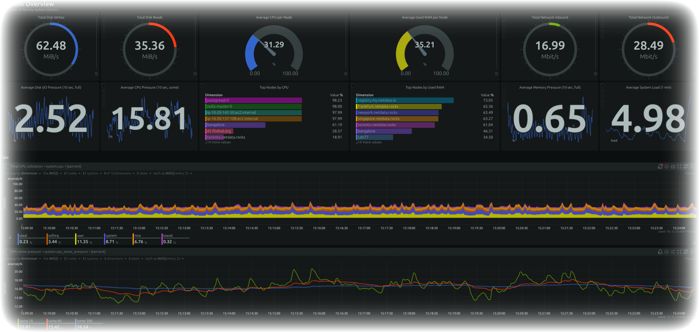

# Hi, I'm George Anestopoulos! 👋

Welcome to my GitHub profile!

## About Me

I am a DevOps Engineer with a passion for automating and optimizing processes. My expertise lies in building and managing CI/CD pipelines, cloud infrastructure, and on-premises systems. I enjoy working with the latest technologies and continually improving my skill set through hands-on experience and ongoing learning.

## Contact Me

- LinkedIn: [Your LinkedIn Profile](https://www.linkedin.com/in/aganet)
- Email: [george@ganesto.com](mailto:github@ganesto.com)
- Personal Website: [ganesto.com](https://ganesto.com)

<!--
**aganet/aganet** is a ✨ _special_ ✨ repository because its `README.md` (this file) appears on your GitHub profile.

Here are some ideas to get you started:

- 🔭 I’m currently working on ...
- 🌱 I’m currently learning ...
- 👯 I’m looking to collaborate on ...
- 🤔 I’m looking for help with ...
- 💬 Ask me about ...
- 📫 How to reach me: ...
- 😄 Pronouns: ...
- ⚡ Fun fact: ...
-->

  
    
  

